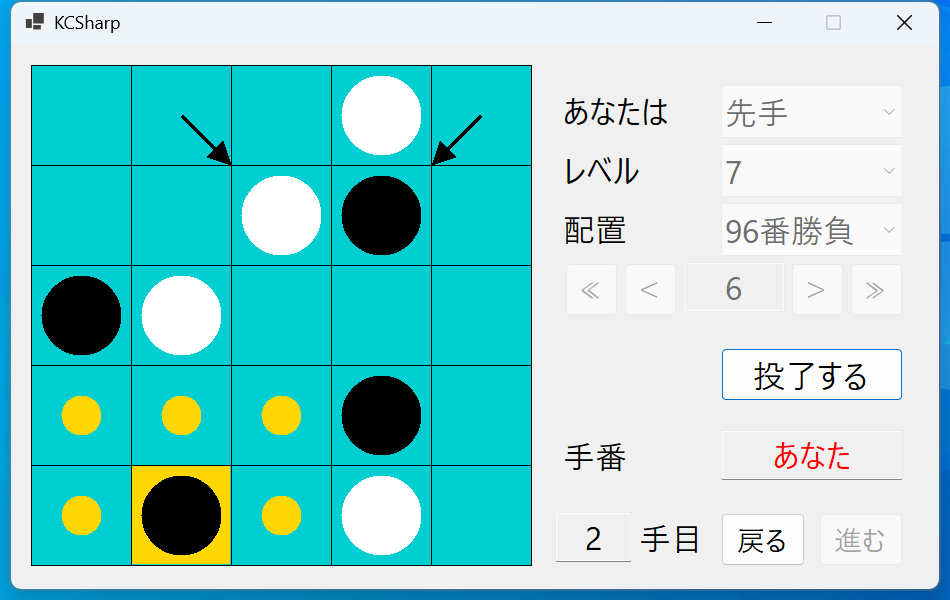

# KCSharp (C#版 形四アプリ)

「形四（けいし）」とは、白黒４つのコマで正方形をつくるボードゲームです。  
詳しくは下記のWebサイトを参照してください。
- [「形四」ゲームの解説：ひとコマ解説 - dnjiro’s 9VAe blog](https://dnjiro.hatenablog.com/entry/keisi)

KCSharp は、C#で作成したWindows用の形四アプリです。  
実行ファイルのダウンロードは [こちら](https://github.com/lipoyang/KCSharp/releases/) から。

